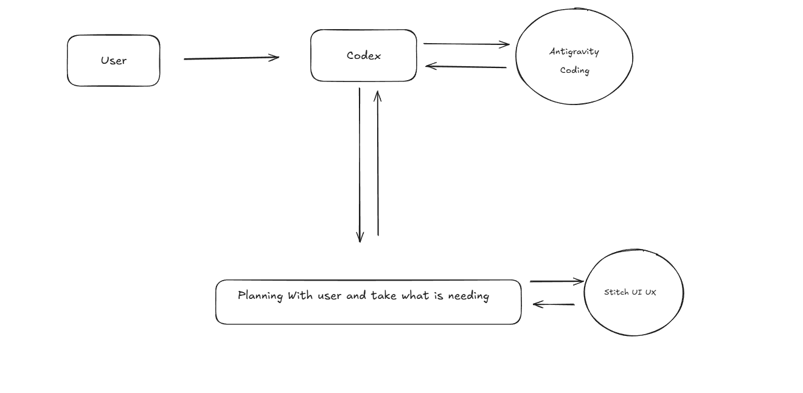
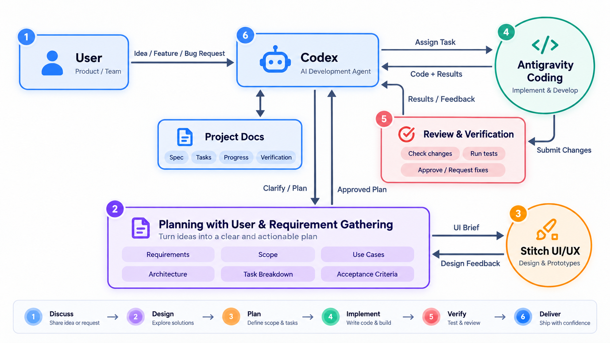
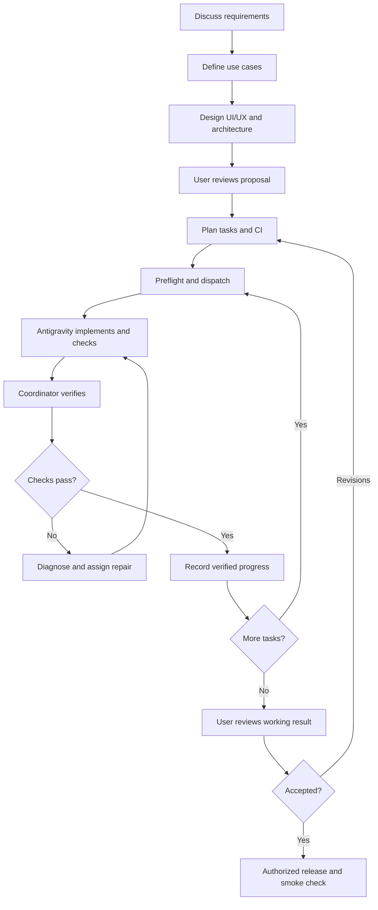

# AgentWorkFlow

A reusable framework for creating projects and editing existing ones with an AI coordinator, Antigravity as the implementation executor, and a human making product decisions and reviewing the result.

Requirements, use cases, architecture, UI/UX design, tasks, progress, and verification live in Markdown alongside your project. PowerShell scripts provide preflight checks and Antigravity CLI dispatch with saved execution evidence.

**Current status:** a live isolated pilot passed implementation, scoped test execution, conversation continuation, follow-up changes, and independent verification. Runner regression tests cover configuration, permissions, failure reporting, and project concurrency. See [PILOT-REPORT.md](workflow/PILOT-REPORT.md). Hosted CI, live timeout recovery, and project-specific Stitch generation remain unverified.

## Contents

- [Roles and lifecycle](#roles-and-lifecycle)
- [Quick start](#quick-start)
- [Requirements and design](#requirements-and-design)
- [Executing tasks](#executing-tasks)
- [Verification and repairs](#verification-and-repairs)
- [CI and dependency security](#ci-and-dependency-security)
- [File guide](#file-guide)
- [Resuming and troubleshooting](#resuming-and-troubleshooting)
- [References](#references)

## Roles and lifecycle



| Role | Responsibility |
| --- | --- |
| You | Describe the problem, choose product direction, review architecture/design, and accept the working result. |
| AI coordinator | Inspect, clarify, plan, maintain documents, dispatch tasks, review changes, and independently verify results. |
| Antigravity | Implement assigned work, run permitted checks, and return changes, evidence, and limitations. |
| Stitch MCP | Produce concrete UI proposals and design references during planning. |





For small bugs, use a shorter path: reproduce -> diagnose -> repair -> verify. Document affected design and architecture without forcing a full redesign. Use the full planning path for new projects and substantial features.

## Quick start

### 1. Get the reusable starter

```powershell
git clone https://github.com/MedoZzZ/AgentWorkFlow.git
```

Create your application directory separately, or use an existing application directory. Copy the framework into it as `workflow`, preserving existing project instructions and files.

This repository contains historical smoke-test evidence. **Copy templates and scripts without copying previous runs, tasks, or connection-test records.** From inside the cloned starter:

```powershell
$projectRoot = 'C:\Projects\MyApp'
$workflowTarget = Join-Path $projectRoot 'workflow'
if (Test-Path -LiteralPath $workflowTarget) {
    throw 'A workflow already exists. Resume or reconcile it first.'
}
New-Item -ItemType Directory -Path $workflowTarget -Force | Out-Null
Get-ChildItem -LiteralPath '.\workflow' -File |
    Where-Object { $_.Name -notin @('CONNECTION-TEST.md', 'PILOT-REPORT.md') } |
    Copy-Item -Destination $workflowTarget
Copy-Item -LiteralPath '.\workflow\scripts' -Destination $workflowTarget -Recurse
New-Item -ItemType Directory -Path (Join-Path $workflowTarget 'tasks') | Out-Null
```

This copies the top-level documents and scripts, leaving old run evidence and tasks behind. Initialize project-specific progress in the new chat; inherited starter history does not mean your application has been implemented or tested.

On Linux, run these commands from the cloned starter in Bash:

```bash
project_root="$HOME/projects/MyApp"
workflow_target="$project_root/workflow"
if [ -e "$workflow_target" ]; then
  printf '%s\n' 'A workflow already exists. Resume or reconcile it first.' >&2
else
  mkdir -p "$workflow_target/tasks"
  find workflow -maxdepth 1 -type f ! -name CONNECTION-TEST.md ! -name PILOT-REPORT.md \
    -exec cp -t "$workflow_target" -- {} +
  cp -R workflow/scripts "$workflow_target/"
fi
```

Use the Linux project path in the chat prompt below, for example `/home/yourname/projects/MyApp/workflow`.

### 2. Start a project chat

Open the application project in your coding tool and paste this prompt, replacing the path and idea:

> Use the framework in C:\Projects\MyApp\workflow. Read START-HERE.md, LIFECYCLE.md, and EXECUTION.md. This is a fresh copy: initialize project-specific progress. I want to [describe the project or change]. Discuss requirements, use cases, UI/UX design, and architecture with me before implementation. Use Stitch MCP for concrete UI proposals when available. Present the design and architecture for review, then prepare small Antigravity assignments. Independently verify returned work, maintain progress, and configure CI appropriate to this project's stack and repository host. Check actual tool access and report unavailable capabilities explicitly.

The coordinator maintains the Markdown. You provide decisions and reviews; you do not need to fill every template yourself. Unknown details remain questions until resolved.

### 3. Establish Antigravity access

Install and authenticate the official [Antigravity CLI](https://antigravity.google/docs/cli/install/). Confirm its capabilities:

```powershell
agy --help
```

Scripts support Windows and Linux using **PowerShell 7.2 or later** (`pwsh`). Install it using the official [Windows instructions](https://learn.microsoft.com/en-us/powershell/scripting/install/installing-powershell-on-windows) or [Linux instructions](https://learn.microsoft.com/en-us/powershell/scripting/install/installing-powershell-on-linux). Windows PowerShell 5.1 is insufficient. Application runtimes depend on your project's stack.

The runner searches PATH, then `%LOCALAPPDATA%\agy\bin\agy.exe` on Windows or `~/.local/bin/agy` on Linux. An explicit `-CliPath` or `antigravity.cliPath` overrides discovery. Keep `cliPath` empty when sharing the starter between machines.

On Linux, install the CLI using its official instructions, authenticate by running `agy`, and confirm access from the same Linux account that will run the workflow. A Windows installation or sign-in does not establish Linux CLI access. For WSL, native Linux project storage (such as `~/projects/MyApp`) is preferred for filesystem behavior and performance.

From Bash, invoke the scripts through `pwsh`; executable bits and a separate Bash runner are unnecessary:

```bash
project_root="$HOME/projects/MyApp"
pwsh -NoProfile -File "$project_root/workflow/scripts/Preflight.ps1" \
  -ProjectRoot "$project_root"
pwsh -NoProfile -File "$project_root/workflow/scripts/Run-Antigravity.ps1" \
  -ProjectRoot "$project_root" \
  -TaskFile "$project_root/workflow/tasks/TASK-001.md" \
  -RunId TASK-001-round-01
# After the implementation task is approved, add -Mode accept-edits.
pwsh -NoProfile -File "$project_root/workflow/scripts/Test-Configuration.ps1"
```

Windows users can use the PowerShell examples below from a `pwsh` session. The config, task documents, evidence format, and lifecycle are identical on both platforms. Paths and application test commands must match the machine. See [Linux verification](workflow/LINUX.md).

The coordinator needs terminal access and permission to launch the CLI. Antigravity needs project access and permissions for assigned actions. The runner does not bypass permissions. Desktop installation alone does not establish CLI authentication, subscription entitlement, or model availability; check the intended account.

If automatic dispatch is unavailable, use [ANTIGRAVITY-HANDOFF.md](workflow/ANTIGRAVITY-HANDOFF.md) for manual prompt transfer and return the results to the coordinator.

## Requirements and design

Prepare and review these documents before application implementation:

| Document | Contents |
| --- | --- |
| [PROJECT-SPEC.md](workflow/PROJECT-SPEC.md) | Problem, requirements, scope, constraints, acceptance criteria, and review record. |
| [USE-CASES.md](workflow/USE-CASES.md) | Actors, permissions, journeys, alternative/error flows, and expected outcomes. |
| [DESIGN.md](workflow/DESIGN.md) | Layouts, content, components, navigation, actions, states, responsive rules, and accessibility expectations. |
| [ARCHITECTURE.md](workflow/ARCHITECTURE.md) | System boundaries, modules, data, interfaces, technologies, tradeoffs, deployment, and verification strategy. |

For UI work, follow [STITCH-UI-UX.md](workflow/STITCH-UI-UX.md): prepare a specific brief, generate relevant screens, inspect them, revise feedback, and record the selected version. Antigravity receives the chosen references and explicit interaction specifications. Static mockups do not prove forms, navigation, keyboard access, or error handling work.

Respect existing architecture and design conventions. For nonvisual projects, specify API/CLI interactions instead of inventing screens. Record user agreement and resolve blocking questions before dependent implementation.

## Executing tasks

### Editable configuration

Edit [workflow/config.json](workflow/config.json) for project-wide defaults: model, mode, timeout, CLI path, and preflight command/manifest discovery. The starter defaults to `gemini-3.8-flash-high`, `plan` mode, and 600 seconds. Per-run arguments override these settings. Both scripts accept `-ConfigPath` to use a different complete config, including a shared defaults file. See [CONFIGURATION.md](workflow/CONFIGURATION.md).

The runner passes the selected model explicitly and records effective settings in metadata. Config validation rejects unsupported keys and invalid values before dispatch. Run `workflow/scripts/Test-Configuration.ps1` to check defaults, overrides, model forwarding, and invalid-config handling without invoking a real model.

### Preflight

From the application directory:

```powershell
.\workflow\scripts\Preflight.ps1 -ProjectRoot 'C:\Projects\MyApp'
```

The JSON report includes the resolved directory, CLI availability, Git revision/changes when a committed repository is detected, common runtime command locations, root-level manifests, and workflow presence.

Preflight does not install dependencies, verify authentication/runtime versions, discover every monorepo package, or run tests. Run the actual baseline checks recorded in CI.md before editing. The current script does not report a Git repository without a HEAD commit as a committed baseline.

### Prepare a task

Copy [TASK-TEMPLATE.md](workflow/TASK-TEMPLATE.md) into `workflow/tasks/TASK-001.md`. The coordinator fills the goal, requirement IDs, dependencies, relevant context, numbered instructions, acceptance checks, and expected evidence. Start only when dependencies are verified.

### Dispatch a read-only assignment

```powershell
.\workflow\scripts\Run-Antigravity.ps1 `
    -ProjectRoot 'C:\Projects\MyApp' `
    -TaskFile 'C:\Projects\MyApp\workflow\tasks\TASK-001.md' `
    -RunId 'TASK-001-plan-01'
```

Default mode is `plan`, with an explicit read-only instruction. This is not an independent operating-system isolation boundary.

### Dispatch implementation after review

```powershell
.\workflow\scripts\Run-Antigravity.ps1 `
    -ProjectRoot 'C:\Projects\MyApp' `
    -TaskFile 'C:\Projects\MyApp\workflow\tasks\TASK-001.md' `
    -RunId 'TASK-001-round-01' `
    -Mode accept-edits `
    -TimeoutSeconds 600
```

Replace example paths with your project. Use a unique run ID for each intentional dispatch.

| Parameter | Description |
| --- | --- |
| `ProjectRoot` | Existing project directory and CLI working directory. |
| `TaskFile` | Existing task file inside that project. |
| `RunId` | Unique identifier using letters, digits, hyphens, or underscores. |
| `Mode` | `plan` by default; `accept-edits` for implementation. |
| `TimeoutSeconds` | CLI print timeout, 10–3600 seconds; default from config (600). |
| `ConversationId` | Optional captured ID for continuing the intended task's conversation. |
| `CliPath` | Optional explicit CLI executable path. |
| `Model` | Optional model slug overriding config. |
| `ConfigPath` | Optional alternate complete configuration file. |

### Saved evidence

Every run creates `workflow/runs/<RunId>/`:

| File | Purpose |
| --- | --- |
| `preflight.json` | Starting environment and Git information. |
| `prompt.txt` | Exact dispatched prompt. |
| `stdout.json` | CLI result and response metadata. |
| `stderr.log` | Diagnostics, errors, and permission notices. |
| `metadata.json` | Task, timestamps, status, exit code, conversation ID, and pending verification. |
| `config.json` | Snapshot of parsed framework defaults; effective overrides are in metadata. |

A permanent `<RunId>.lock` rejects reuse of that ID. An OS-held `active.lock` also prevents different IDs from running concurrently in the same project. Its file may remain after a run; the exclusive handle releases when the process exits.

The runner does not schedule repairs or automatically update PROGRESS.md. The coordinator reviews results and updates task/progress records. Inspect logs and actual files after a timeout or interruption before dispatching again; execution may have already made changes.

## Verification and repairs

Antigravity reports `ready-for-verification`. The coordinator inspects the diff, independently runs relevant checks, checks UI behavior when applicable, and records the verdict for the tested revision/file state.

**CLI SUCCESS is not task verification.** The runner rejects reported denied actions as `blocked-permissions` and blank successful responses as `empty-response`. Caught execution errors become `failed`; malformed JSON becomes `invalid-output`. Inspect stderr and compare actual outcomes against acceptance criteria. Missing, skipped, or unavailable verification is recorded explicitly.

```text
draft -> ready -> in-progress -> ready-for-verification -> verified
                                  |
                                  +-> needs-fix -> in-progress
```

Any unfinished task can become `blocked`, with a reason and resume condition. Only verified tasks count as done. User acceptance and release status are separate records.

For each repair, preserve the observed failure, expected behavior, requested fix, and recheck evidence. After three unsuccessful rounds, diagnose and revise the approach. Do not weaken requirements or remove failing tests merely to obtain a pass.

Map requirement IDs to use cases, screen IDs, tasks, and evidence. Check important negative cases as well as happy paths. Review changes to tests themselves. Use small reviewed Git checkpoints where available and preserve existing user changes. Scripts do not commit, merge, push, reset, or deploy.

## CI and dependency security

This framework has its own Windows and Ubuntu GitHub Actions matrix in `.github/workflows/framework-checks.yml`. It exercises configuration, runner failures, process locking, and platform path rules using a mock CLI, requiring no model credentials or subscription. Local checks have run; the hosted workflow needs to run after the changes are pushed. Copy or merge this workflow into the application's CI separately if you want these framework checks there; the template-copy commands above copy only `workflow`.

[CI.md](workflow/CI.md) is the project's pipeline specification template, not a preconfigured hosted pipeline. Implement it for the actual stack and provider:

- Reproducible dependency installation using the committed lockfile and supported runtime.
- Relevant static checks, behavior tests, integration checks, and production build.
- Useful failure logs and test artifacts.
- Vulnerability scanning and review of package identity/source, unexpected transitive changes, and install scripts.
- Malicious-package detection where supported, with suspicious findings investigated.
- Required status checks and branch protections where access permits.

A vulnerability scan does not establish that a package is malware-free. CI configuration alone does not prevent merging; repository protections must be configured separately. Hosted runs that cannot be observed remain unverified even when local checks pass.

Release follows user acceptance and authorization. Record deployment, migration, recovery, and deployed smoke-check results in project documents.

## File guide

| File | Purpose |
| --- | --- |
| [START-HERE.md](workflow/START-HERE.md) | Copying, starting, and resuming. |
| [LIFECYCLE.md](workflow/LIFECYCLE.md) | Stages, roles, and completion rules. |
| [PROGRESS.md](workflow/PROGRESS.md) | Done, active, next, blockers, and review/release status. |
| [EXECUTION.md](workflow/EXECUTION.md) | Preflight, dispatch, context, checkpoints, and evidence. |
| [TASK-TEMPLATE.md](workflow/TASK-TEMPLATE.md) | One assignment, executor report, verification, and repair history. |
| [ANTIGRAVITY-HANDOFF.md](workflow/ANTIGRAVITY-HANDOFF.md) | Executor instructions and return contract. |
| [SKILL-GUIDE.md](workflow/SKILL-GUIDE.md) | Source skill guidance and adaptations. |
| `scripts/` | Preflight and Antigravity runner. |
| `tasks/` | Project-specific tasks. |
| `runs/` | Generated evidence; exclude from fresh copies. |

Task files are the source of truth for task status; PROGRESS.md summarizes them. The coordinator maintains planning/verification, and Antigravity records task results. Load only context relevant to the current task. Record recurring failures and actionable improvements after milestones.

## Resuming and troubleshooting

Resume prompt:

> Resume the project using C:\Projects\MyApp\workflow. Read progress, the spec, use cases, design, architecture, and active task evidence. Inspect the actual project state and continue the next eligible step.

| Problem | Action |
| --- | --- |
| CLI not found | Check installation/PATH or supply `-CliPath`. |
| Authentication required | Complete sign-in with the intended account, then test again. |
| CLI user-directory initialization denied | Resolve execution-environment permissions and record the failure. |
| Tool denied despite SUCCESS | Inspect stderr and actual work; arrange the necessary scoped permissions. |
| Run ID already exists | Inspect its original evidence; use a new ID only for an intentional new run. |
| Timeout, interruption, or invalid output | Reconcile logs and files before retrying. |
| Stitch unavailable | Record the limitation and discuss a concrete fallback. |
| Hosted CI unavailable | Keep hosted verification pending and report local checks separately. |

Run artifacts may contain prompts, absolute paths, or sensitive output. Review/redact them before sharing or committing, and exclude local run directories from application source control where appropriate. Keep credentials and secrets out of Markdown, prompts, and source control. Historical connection records in this starter are examples from its initial environment, not portable settings.

## References

This framework adapts [Matt Pocock's skills](https://github.com/mattpocock/skills) for specification writing, small task decomposition, behavior-based testing, and handoffs. The upstream skills are referenced rather than installed by this repository. Native loading in Antigravity has not been verified; see [SKILL-GUIDE.md](workflow/SKILL-GUIDE.md) for exact sources and adaptations.

Antigravity references: [installation/authentication](https://antigravity.google/docs/cli/install/) and [headless execution](https://antigravity.google/docs/cli/headless/). Check the installed CLI's help because flags and permission behavior can change.
